# Introduction

Online complete coverage requires a robot to cover all accessible free space in a workspace, while avoiding obstacles. In the online setting, the robot does not have a complete prior map and must instead build knowledge during motion.

This report focuses on BA*, an online complete coverage algorithm that combines boustrophedon motion for local sweeping with A* on a discrete tiling model for intelligent backtracking. The key idea is that the robot sweeps efficiently most of the time, but when it reaches a dead-end or boundary situation, it selects a new starting point and returns to it through a collision-free path computed using A* on tiling with a smoothing post-process (A*SPT).

The goal of this report is to describe the BA* method as implemented in our simulation, and to prepare an evaluation structure covering coverage rate, path length, and number of boustrophedon regions.

# Background and Related Work

## Boustrophedon Cellular Decomposition as an offline baseline

A common baseline for coverage planning in known environments is Boustrophedon Cellular Decomposition (BCD). BCD decomposes the free space into cells using a sweep-line process; it then builds an adjacency graph of cells and plans a traversal to cover each cell with boustrophedon-like motions. BCD is effective when the map is known, but it assumes the workspace model is available before execution.

BA* is related in spirit because it uses boustrophedon-style sweeping to achieve efficient coverage, but BA* operates online and does not rely on a precomputed decomposition.

## A* as used inside BA*

BA* uses A* as a local planner on a discrete tiling graph, not as a general continuous-space motion planner. The algorithm maintains a tiling model of discovered space and constructs a graph whose nodes are tiles and whose edges connect neighboring tiles. When BA* needs to backtrack from a current critical point to a selected starting point, it runs A* on this graph.

In our use, A* employs:

* A cost-to-come term $g(s)$ that accumulates path cost on the tiling graph.
* A heuristic $h(s)$ that is the straight-line distance from a tile to the goal tile center.

Under standard A* assumptions (non-negative edge weights and an admissible heuristic), A* finds a shortest path on the tiling graph. However, the resulting path may contain unnecessary turns on a grid-like graph; this motivates a smoothing step (A*SPT) after A*.


# BA* Method

This section presents the BA* algorithm as used in our implementation. The method consists of the workspace and robot model, the tiling model, the boustrophedon coverage mode, and the backtracking mechanism.

To illustrate every step of the algorithm, we will track a single scenario:

* **Unified Scenario:** A robot named "Bot" with radius $r=5$ (diameter $10$) operates in a room.
* **Phase 1 (Start):** Bot starts at $(12, 75)$ facing East.
* **Phase 2 (Stuck):** Later, Bot ends up at $(88, 1)$ and gets stuck (Critical Point).
* **Phase 3 (Recovery):** Bot calculates a plan to return to a safe spot at $(52, 1)$.

Run summary (from `summary.json`):

* Total steps: $7505$.
* Coverage rate: $1.0$.
* Total path length: $7505.0$.
* Number of backtracking events: $10$.
* First backtracking event statistics:
  * $s_{cp}=(88, 1)$.
  * $s_{sp}=(52, 1)$.
  * Number of candidates: $32$.
  * A* path length (tile steps): $37$.
  * Smoothed path length (waypoints): $2$.

---

## Workspace and robot model

BA* targets online complete coverage in an unknown closed workspace. The robot is assumed to move in planar space with configuration:

$$
q = [x, y, \theta]^T
$$

where $(x,y)\in\mathbb{R}^2$ is the robot center position in the plane and $\theta$ is the heading angle. The robot is modeled as a circle with radius $r$, and the free configuration space is denoted $C_{\text{free}}$.

Motion primitives used in the report are:

* Forward translation of distance $d$ at heading $\theta$:

$$
q'=
\begin{bmatrix}
x' \\
y' \\
\theta'
\end{bmatrix} =
\begin{bmatrix}
x \\
y \\
\theta
\end{bmatrix}
+
\begin{bmatrix}
d\cos\theta \\
d\sin\theta \\
0
\end{bmatrix}.
$$

* **In-place rotation** by angle $\alpha$:
    
$$
q'=
\begin{bmatrix}
x' \\
y' \\
\theta'
\end{bmatrix} =
\begin{bmatrix}
x \\
y \\
\theta
\end{bmatrix}
+
\begin{bmatrix}
0 \\
0 \\
\alpha
\end{bmatrix}.
$$

BA* uses a discrete heading set aligned with the four cardinal directions. In this report, we follow the convention (as stated in the draft) that $0$ points East and:

* East: $0$
* North: $\pi/2$
* West: $\pi$
* South: $-\pi/2$

### Unified Example: Phase 1 (Movement)

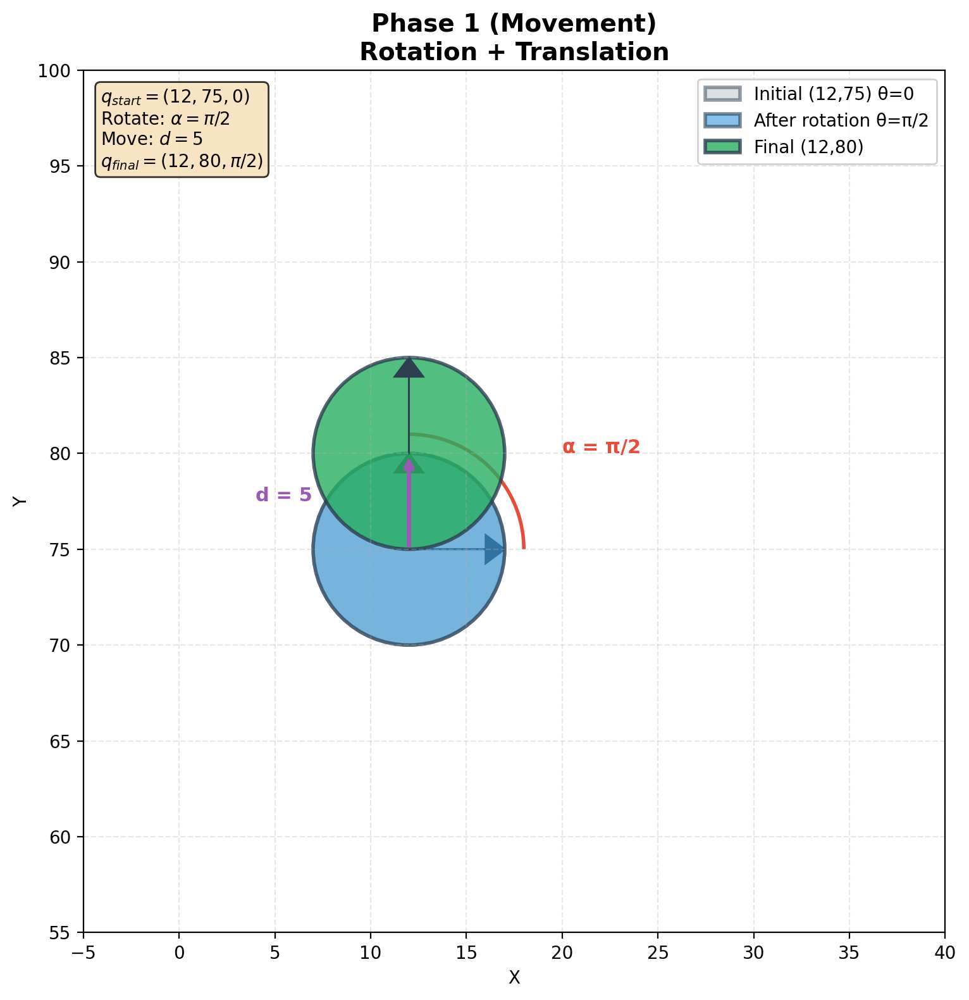

**Scenario:** Our robot starts at $(12,75)$ facing East. It rotates North and moves forward one step.

1.  **Initial State:**
    
$$q_{\text{start}}=\begin{bmatrix}12 \\ 75 \\ 0\end{bmatrix}$$

2.  **Rotation:** Rotate to face North ($\alpha=\pi/2$).

$$
q_{\text{rotated}}=
\begin{bmatrix}
12 \\
75 \\
0
\end{bmatrix} +
\begin{bmatrix}
0 \\
0 \\
\pi/2
\end{bmatrix} =
\begin{bmatrix}
12 \\
75 \\
\pi/2
\end{bmatrix}
$$

3.  **Translation:** Move forward by radius distance $d=5$.
    
$$
q_{\text{final}}=
\begin{bmatrix}
12 \\
75 \\
\pi/2
\end{bmatrix} +
\begin{bmatrix}
5\cos(\pi/2) \\
5\sin(\pi/2) \\
0
\end{bmatrix} =
\begin{bmatrix}
12 \\
80 \\
\pi/2
\end{bmatrix}
$$

## Discrete tiling model $M$

### Tile definition and incremental construction

BA* constructs a tiling model incrementally. Each visited configuration induces a tile index in a regular grid, where the tile spacing depends on the robot radius. In our report, a tile state is denoted:
$$
s=(x,y,2r)
$$
where the parameters are defined as follows:

* **$(x, y)$:** This is the center point of the tile. It corresponds to the robot's position in the workspace at the moment the tile was created.
* **$2r$:** This represents the size (side length) of the square tile. Since $r$ is the robot's radius, $2r$ corresponds to the robot's diameter.
* **Area:** Consequently, the area covered by a single tile is the square of the diameter, $4r^2$. The tile physically represents the square bounding box that fully contains the circular robot at that position.

The paper defines the tiling model as a set of tiles generated in free space:

$$
M = \{s \mid s \in C_{\text{free}}\}
$$

* **$C_{\text{free}}$:** This represents the "Free Space" (Configuration Space), which is the set of all valid configurations where the robot does not intersect with obstacles.
* **$M$:** This is the robot's accumulated memory or map. It starts as an empty set and grows incrementally as the robot moves and "stamps" new tiles onto the grid.

#### Explanation of $C_{free}$

In the BA* algorithm, the robot's environment is divided into "valid" and "invalid" states. The Free Space ($C_{\text{free}}$) represents the set of all "valid" configurations—meaning every possible position and orientation where the robot can physically exist without crashing into a wall or object.

The mathematical definition is:

```math
C_{\text{free}} = \left\{ q\in C \;\middle|\; A(q)\cap\left(\bigcup_i O_i\right)=\varnothing \right\}
```


Where:
* **$q$ (Configuration):** The specific state of the robot at a single moment (defined earlier as $[x, y, \theta]^T$).
* **$C$ (Configuration Space):** The "universe" of all possible configurations, regardless of obstacles.
* **$A(q)$ (Robot Footprint):** The physical portion of the workspace occupied by the robot $A$ when placed at configuration $q$.
* **$O_i$ (Obstacle $i$):** A single obstacle in the workspace.
* **$\bigcup_i O_i$ (Obstacle Region):** The union of all obstacles, representing all solid, non-traversable points.
* **$\cap$ (Intersection) & $\varnothing$ (Empty Set):** The intersection checks for overlap. The formula requires this overlap to be the empty set (zero overlap).

> **Semantic translation:** "The Free Space ($C_{\text{free}}$) consists of all configurations ($q$) where the robot's physical body ($A(q)$) does not touch any part of the combined obstacle region."

### Covered vs visited and a consistent discovered state

To make predicates like “blocked”, “covered”, and “uncovered” explicit, we maintain a discovered tiling state as a partial function:

$$
\hat{M}:\mathbb{Z}^2 \to \{ \text{unknown}, \text{covered}, \text{obstacle} \}
$$

From $\hat{M}$ we derive:

$$
\begin{aligned}
C_{\text{cov}} &= \{ s: \hat{M}(s)=\text{covered} \}, \\
C_{\text{obs}} &= \{ s: \hat{M}(s)=\text{obstacle} \}, \\
C_{\text{unk}} &= \{ s: \hat{M}(s)=\text{unknown} \}.
\end{aligned}
$$

In this report, the “current tiling model” used by BA* for planning is the covered set:
$$
M \equiv C_{\text{cov}}.
$$

We use the convention from the draft that a blocked position is "either an obstacle or a covered tile":

$$
\begin{aligned}
\text{isBlocked}(s) &\iff \hat{M}(s)\in \{ \text{covered}, \text{obstacle} \}, \\
\text{isUncovered}(s) &\iff \hat{M}(s)=\text{unknown}
\end{aligned}
$$

The key invariant emphasized in this report is:
* **Covered at most once:** a tile becomes covered when first swept by boustrophedon motion and is never “uncovered” again.

### Unified Example: Phase 2 (Tiling)

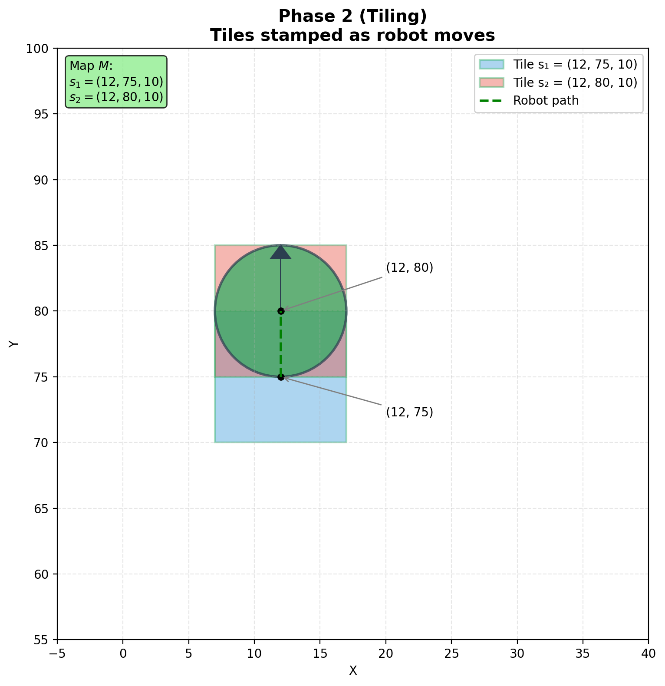

**Scenario:** Continuing from Phase 1, the robot creates tiles as it moves.

1.  **Tile 1:** When at $(12, 75)$, it stamped:
    $$s_1 = (12, 75, 10).$$
    *(Center 12,75; Size 10)*

2.  **Tile 2:** After moving to $(12, 80)$, it stamps:
    $$s_2 = (12, 80, 10).$$

3.  **Update Map:**
    $$M = \{ (12, 75, 10), (12, 80, 10) \}.$$
    The map $M$ now contains these two discrete squares.

## Boustrophedon motion as coverage mode

### Boustrophedon Motion and Critical Points

In BA*, **boustrophedon motion (BM)** is the default coverage behavior. The robot moves in parallel sweep lines across free space, alternating direction at boundaries, and marking tiles as covered as it sweeps.

The coverage process continues until BM can no longer extend the sweep without hitting blocked tiles or obstacles, at which point BA* declares a critical point and switches to backtracking.

### Critical point definition

A tile $s$ is treated as a **critical point** when it is locally enclosed by blocked tiles in the 4-neighborhood. The formal definition is:

$$
s \text{ is critical } \iff \forall s'\in N_4(s),\ \text{isBlocked}(s')
$$

Where:

* **$s$ (Current Tile):** The tile the robot occupies.
* **$N_4(s)$ (4-Neighborhood):** The set of four immediate neighbors: North, South, East, West.
* **$\text{isBlocked}(s')$:** Returns True if neighbor $s'$ is an obstacle or already covered.

> **Semantic translation:** "Tile $s$ is critical **if and only if** **all** four neighbors are **blocked**."

### Unified Example: Phase 3 (Stuck)

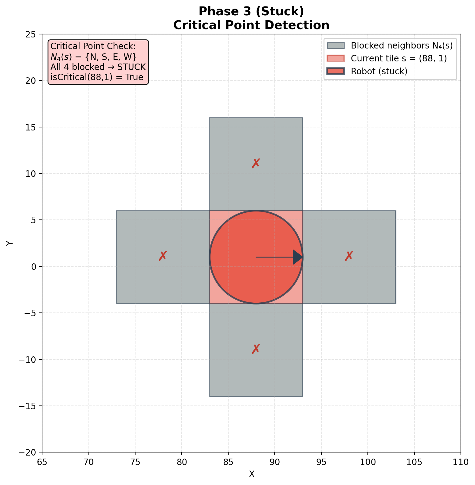

**Scenario:** Time has passed. The robot is now at **$(88, 1)$**. It needs to check if it is stuck.

1.  **Current Tile:** $s = (88, 1, 10)$.

2.  **Neighbors ($N_4$):**
    The algorithm checks the four cardinal neighbors in $N_4(s)$. If all 4 neighbors are blocked, then $s$ is a critical point.

3.  **Result:** Since this run reports a critical point at $(88, 1)$, we treat:
    $$\text{isCritical}(88, 1) = \text{True}$$
    The robot declares a **Critical Point** and stops sweeping.

---

## Backtracking list $L$

BA* maintains a list $L$ of candidate tiles that may serve as future starting points for new boustrophedon sweeps. These are typically tiles on boundaries between covered and uncovered regions, detected using local neighbor relationships.

### Neighbor indexing
The 8-neighborhood of a tile $s$ is defined as:
$$
N(s)=\{s_1,s_2,s_3,s_4,s_5,s_6,s_7,s_8\},
$$
corresponding to **east, north-east, north, north-west, west, south-west, south, south-east**.

The 4-neighborhood is:
$$
N_8(s)=N(s),\qquad N_4(s)=\{s_1,s_3,s_5,s_7\}
$$

* **$s$:** The central tile currently being analyzed.
* **$s_1 \dots s_8$:** The eight surrounding tiles, indexed counter-clockwise starting from East ($s_1$).

### Boundary indicator $b$
We define a function to detect "free-to-blocked" edges:

$$
b(s_i,s_j)=
\begin{cases}
1, & \text{if } s_i \text{ is free and } s_j \text{ is blocked} \\
0, & \text{otherwise}
\end{cases}
$$

Using $\hat{M}$, one concrete realization used in the draft is:

$$
\begin{aligned}
s_i \text{ is free } &\iff \hat{M}(s_i)=\text{unknown}, \\
s_j \text{ is blocked } &\iff \hat{M}(s_j)\in \{ \text{covered}, \text{obstacle} \}
\end{aligned}
$$

Where: 

* **$b(s_i, s_j)$:** A binary check that returns **1** only if the first neighbor ($s_i$) is unexplored and the second neighbor ($s_j$) is an obstacle or already visited.
* **$\hat{M}(s_i)$:** The status of the tile in the robot's memory (Unknown, Covered, or Obstacle).

**Semantic translation:**
> "The boundary indicator $b$ for a pair of tiles is **1** if the first tile is **free** (unknown) AND the second tile is **blocked** (obstacle/covered). Otherwise, it is **0**."


### Corner detector $\mu(s)$

The draft defines a corner score $\mu(s)$ by summing boundary indicators on selected neighbor pairs:

$$
\mu(s)=b(s_1,s_8)+b(s_1,s_2)+b(s_5,s_6)+b(s_5,s_4)+b(s_7,s_6)+b(s_7,s_8).
$$

Where:

* **$\mu(s)$:** A "corner score" integer. If this is greater than 0, the tile is sitting on a geometric corner of the unexplored area.
* **The Sum:** It checks six specific neighbor pairs (like East vs South-East, or West vs South-West) to capture different corner orientations.

> **Semantic translation:** "The corner score is the sum of specific neighbor pairs that represent geometric corners. If $\mu > 0$, the tile is on a corner."

### List Construction
A tile is added to the backtracking list when it is a “corner-like” boundary point:

$$
L=\{ s \mid s\in M \text{ and } \mu(s)\ge 1 \}.
$$

### Unified Example: Phase 4 (List Check)

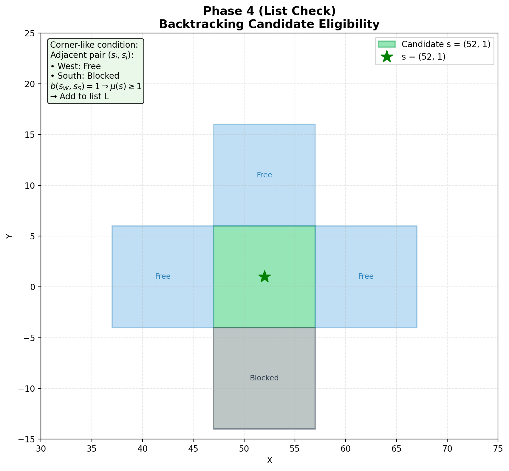

**Scenario:** The robot is stuck at $(88, 1)$, so it checks its accumulated knowledge to form backtracking candidates. In the run summary, the selected starting point is $(52, 1)$.

1.  **Analyze Tile:** $s = (52, 1)$.

2.  **Corner-like condition (illustration):** A tile can be inserted into $L$ when it forms a boundary corner pattern. For example, if for some neighbor pair $(s_i,s_j)$ the first is Free and the second is Blocked, then $b(s_i,s_j)=1$ and this contributes to $\mu(s)$.

3.  **Result:** Under any local neighborhood where $\mu(52, 1) \ge 1$, the tile $(52, 1)$ is eligible to be added to $L$.

---

## Selection of the next starting point

When BA* reaches a critical point $s_{cp}$, it selects a next starting point $s_{sp}\in L$ that minimizes a cost criterion. The report uses a high-level selection:

$$
s_{sp}=\arg\min_{s\in L} f(s,s_{cp}).
$$

Where:

* **$s_{sp}$ (Starting Point):** The "winner" tile selected from the list. This will be the start of the next boustrophedon sweep.
* **$L$ (Backtracking List):** The list of all candidate "corner" tiles identified earlier.
* **$\arg\min$:** A mathematical operator that finds the *argument* (in this case, the tile $s$) that produces the *minimum* value for the function $f$.
* **$f(s, s_{cp})$:** A generalized cost function representing the "expense" (distance, time, or energy) to travel from the current stuck point ($s_{cp}$) to a candidate tile ($s$).

**Semantic translation:**
> "The next starting point $s_{sp}$ is the tile $s$ from the list $L$ that minimizes the cost function $f$ relative to the current critical point $s_{cp}$."

**In simple terms:**
The robot looks at its "To-Do List" and picks the easiest (closest/cheapest) location to travel to right now.

---

In practice, the selection is often based on the shortest backtracking path length computed on the tiling graph:

$$
J(s_{cp},s)=\text{len}\big(\hat{P}(s_{cp}\to s)\big),
$$

$$
s_{sp}=\arg\min_{s\in L} J(s_{cp},s).
$$

Where:

* **$J(s_{cp}, s)$:** The specific cost value used in this implementation (Path Length).
* **$\hat{P}$ (Smoothed Path):** The collision-free path calculated by the path planner (A*SPT), moving from the critical point to candidate $s$.
* **$\text{len}(\dots)$:** The total physical length of that path in meters/units.

**Semantic translation:**
> "The cost $J$ is the length of the smoothed path $\hat{P}$ from the critical point to the candidate. The selected starting point is the candidate $s$ that minimizes this path length."

**In simple terms:**
The robot doesn't just measure a straight line through walls. It calculates the actual walking distance to each candidate and picks the one with the shortest walk.

---

### Unified Example: Phase 5 (Selection)

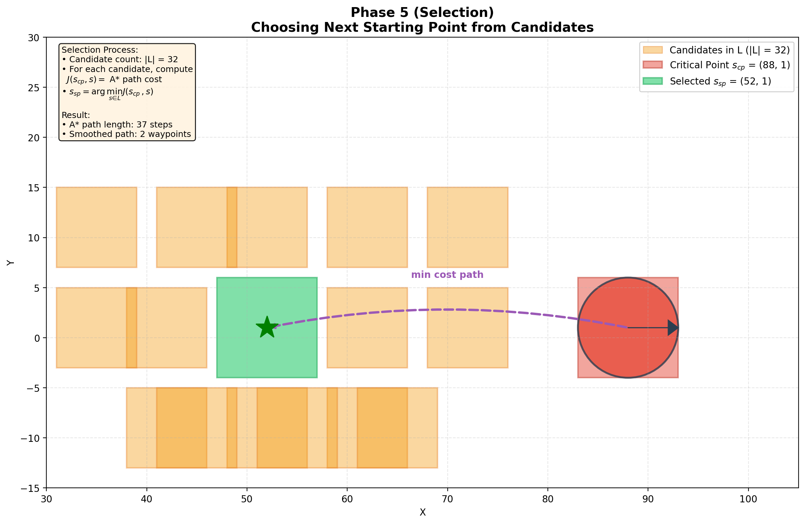

**Scenario:** The robot is currently stuck at the **Critical Point $s_{cp} = (88, 1)$**. It consults its backtracking list $L$.

1.  **Candidate count:** $|L| = 32$.

2.  **Planner outputs for the chosen candidate:**
    * A* path length: $37$ (tile steps).
    * Smoothed path length: $2$ (waypoints).

3.  **Result:**
    $$s_{sp} = (52, 1).$$

---

## Backtracking path planning

### A* on the tiling graph and Smoothing

BA* first plans a collision-free path on the tiling graph from the critical point $s_{cp}$ to the selected starting point $s_{sp}$. Since grid-based paths can be jagged, the path $P$ is then smoothed using A*SPT (A* with Smoothed Path on Tiling) to reduce unnecessary turns.

* **A\* Search:** Finds the shortest path by hopping between adjacent tiles in the robot's memory ($M$).
* **A\*SPT:** A post-processing step that shortcuts the path. It connects the current waypoint to the **farthest** visible waypoint in the path list, skipping intermediate tiles if a straight line of sight exists.

---

### Following the backtracking path

To execute the path, the robot moves from its current pose $q$ to the center of the next waypoint tile $s_{i+1}$. The control commands are computed using three formulas:

* **Heading ($\beta$):**

$$
\beta=\arctan\frac{y_{i+1}-y}{x_{i+1}-x}
$$

* **Rotation ($\alpha$):**

$$
\alpha=\beta-\theta
$$

* **Distance ($d$):**

$$
d=\sqrt{(x_{i+1}-x)^2+(y_{i+1}-y)^2}
$$

#### Explanation of parameters

* **$(x, y)$:** The robot's current position coordinates.
* **$(x_{i+1}, y_{i+1})$:** The target coordinates (the center of the next tile in the smoothed path).
* **$\theta$ (Current Heading):** The direction the robot is currently facing.
* **$\beta$ (Required Heading):** The absolute angle (in the workspace frame) the robot *needs* to face to point directly at the target.
* **$\alpha$ (Steering Angle):** The relative turn required. It is the difference between where the robot *should* look ($\beta$) and where it *is* looking ($\theta$).
* **$d$ (Travel Distance):** The straight-line Euclidean distance to the target.

#### Semantic translation

* **Formula 1 ($\beta$):** "Calculate the absolute direction from 'Here' to 'There' using the inverse tangent (arc-tangent) of the slope."
* **Formula 2 ($\alpha$):** "The turn amount is the Target Angle minus my Current Angle."
* **Formula 3 ($d$):** "The distance to travel is the length of the hypotenuse between the two points."

---

### Unified Example: Phase 6 (Execution)

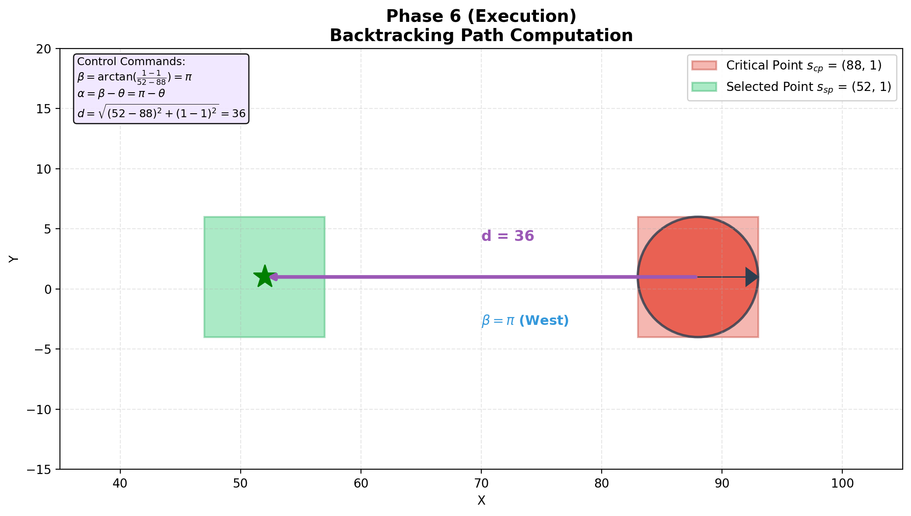

**Scenario:** The robot is currently at the stuck point $(88, 1)$ and has selected $(52, 1)$ as its next destination.

1.  **Current State ($q$):**
    * Position: **$(88, 1)$**
    * Heading: **$\theta$**

2.  **Target Waypoint ($s_{i+1}$):**
    * Coordinates: **$(52, 1)$**

3.  **Compute Control Commands:**

    * **Step A: Calculate Heading ($\beta$)**
        $$\beta = \arctan\left(\frac{1 - 1}{52 - 88}\right) = \arctan\left(\frac{0}{-36}\right).$$
        The displacement $(-36, 0)$ points West, so:
        $$\beta = \pi.$$

    * **Step B: Calculate Rotation ($\alpha$)**
        $$\alpha = \beta - \theta = \pi - \theta.$$

    * **Step C: Calculate Distance ($d$)**
        $$d = \sqrt{(52 - 88)^2 + (1 - 1)^2} = 36.$$

4.  **Execute:**
    The robot rotates by $\alpha$ and moves forward $d$ units. It arrives at $(52, 1)$, completes the backtracking phase, and is ready to start a new coverage sweep.

## Full BA* loop - Pseudocode

1. Initialize $M=\varnothing$.
2. Perform one boustrophedon motion (BM) to cover the current region; stop BM when the robot reaches a critical point $s_{cp}$. 
3. At $s_{cp}$, construct the backtracking list
   $$
   L={, s \mid s\in M \ \text{and}\ \mu(s)\ge 1 ,}.
   $$

4. If $L=\varnothing$, terminate (complete coverage ends). 
5. Select the next starting point
   $$
   s_{sp}=\arg\min_{s\in L} f(s,s_{cp}).
   $$

6. Run A* on the tiling model $M$ to find a collision-free discrete path from $s_{cp}$ to $s_{sp}$. 
7. Smooth/shorten that path using A*SPT to obtain $\hat{P}$. 
8. Follow $\hat{P}$ from $s_{cp}$ to $s_{sp}$. 
9. Adjust heading at $s_{sp}$, then go back to Step 2 for the next BM. 

## Implementation Details

This section describes how BA* is implemented in the accompanying codebase.

### Workspace representation and coordinates

The workspace is a **binary occupancy grid** (`GridMap`) where each state is indexed by an integer cell coordinate:

* A cell is a tuple $c=(x,y)$ with $0 \le x < \text{width}$ and $0 \le y < \text{height}$.
* The grid stores occupancy as `occ[y, x]` with:

  * `occ[y, x] = 1` meaning obstacle,
  * `occ[y, x] = 0` meaning free.
* The coordinate convention follows array indexing: **$y$ increases downward**.

A physical scaling factor `tile_size` exists (`GridSpec.tile_size`) and defaults to $1.0$. In the provided implementation, planning and motion are executed in **grid cells** (one step per edge).

### Discovered map state \hat{M} and tile states

The discovered state $\hat{M}$ is stored as a sparse dictionary `hatM: Dict[Coord, int]`:

* Missing key means `STATE_UNKNOWN`.
* Known states are:

  * `STATE_UNKNOWN = 0`
  * `STATE_COVERED = 1`
  * `STATE_OBSTACLE = 2`

The implementation maintains two derived sets:

* `covered: Set[Coord]` for covered cells.
* `known_obs: Set[Coord]` for discovered obstacle cells.

A cell becomes covered through `_mark_covered(c)`, which only changes a cell from `UNKNOWN` to `COVERED`. An already known obstacle is not overwritten as covered.

### Sensing and obstacle discovery

Obstacle discovery is performed by `_sense()` in `BAStarPlanner`:

* The sensing mode is configured by `BAStarConfig.sense_mode`:

  * `"N8"` senses current cell plus its 8 neighbors.
  * `"N4"` senses current cell plus its 4 neighbors.
  * `"NONE"` disables sensing updates.
* For each sensed cell $c$, if the ground truth grid has an obstacle at $c$, the planner sets:
  $$\hat{M}(c) = \text{OBSTACLE}.$$
* Free cells are not explicitly marked as free; they remain `UNKNOWN` until they become `COVERED`.

### Blocked and uncovered free predicates

Two predicates drive motion and corner detection:

* `is_uncovered_free(c)` is true when:

  * the ground truth cell is free, and
  * $\hat{M}(c)$ is `UNKNOWN`.

* `is_blocked(c)` is true when any of the following hold:

  * $c$ is out of bounds,
  * the ground truth cell is an obstacle,
  * $\hat{M}(c)$ is `COVERED` or `OBSTACLE`.

This means the simulator treats true obstacles as blocked even if they have not been sensed yet.

### Boustrophedon motion mode used in code

The BM step is implemented by `_bm_next_cell(s)`:

* The planner queries 4 neighbors in the fixed order **N, S, E, W** (`neighbors4`).
* It moves to the **first** neighbor that satisfies `is_uncovered_free(nb)`.
* If no neighbor is uncovered free, BM stops and the algorithm checks for a critical point.

### Critical point test

A cell $s$ is treated as a critical point by `_is_critical(s)` when all four cardinal neighbors are blocked:

* Iterate over `neighbors4(s)` (N, S, E, W).
* If any neighbor is not blocked, return false.
* Otherwise return true.

### Candidate list L construction via μ(s)

Candidates are computed by scanning all covered cells:

* `build_candidates_L()` iterates over `self.covered` and inserts any cell $s$ with $\mu(s)\ge 1$.

The corner score is implemented as:

* `neighbors8_indexed(s)` returns the ordered neighbor positions:
  $s_1$ E, $s_2$ NE, $s_3$ N, $s_4$ NW, $s_5$ W, $s_6$ SW, $s_7$ S, $s_8$ SE.
  Out of bounds positions are still generated and later handled by `is_blocked`.

* The indicator is:

$$b(s_i,s_j)=1 \text{ if } s_i \text{ is uncovered free and } s_j \text{ is blocked; else } 0.$$

* The implementation computes:

$$
\mu(s)=b(s_1,s_8)+b(s_1,s_2)+b(s_5,s_6)+b(s_5,s_4)+b(s_7,s_6)+b(s_7,s_8).
$$

### Backtracking graph and A*

Backtracking uses A* over a graph induced by the currently covered cells:

* The A* neighbor function is 4 connected: `neighbors4(c)`.
* A node is passable for A* only if:

  * it is in bounds,
  * it is not an obstacle in the ground truth,
  * and it is in `covered`.

Edge cost is uniform: each move has cost $1$.

The heuristic is Euclidean distance in grid coordinates:
$$h(a,b)=\sqrt{(b_x-a_x)^2+(b_y-a_y)^2}.$$

The A* implementation returns:

* `path`: list of cells from start to goal,
* `cost`: the $g$ cost at the goal,
* `expanded`: number of popped nodes.

### Selecting the next starting point s_sp

`select_start_point(s_cp, L)` supports two modes (`BAStarConfig.prefer_cost`):

1. `EUCLIDEAN`: pick the candidate minimizing Euclidean distance to $s_{cp}$.
2. `A_STAR`: for each candidate $s \in L$, run A* from $s_{cp}$ to $s$ on the covered graph and choose the one with minimum returned `cost` among reachable candidates.

If no candidates exist, or none are reachable by A*, the planner terminates (because `stop_if_no_candidates=True` in `run_unified.py`).

### A*SPT like smoothing and line of sight rule

Smoothing is implemented in `astar_spt_smooth(grid, path)`:

* It greedily jumps from the current waypoint to the **farthest** later waypoint that has line of sight, otherwise it falls back to the next waypoint.
* Line of sight is checked using `grid.line_of_sight(a,b)`:

  * Compute the discrete cell line between $a$ and $b$ using Bresenham.
  * Return true if every cell on that line is free in the ground truth grid.

The output is a shorter waypoint list and a count of how many intermediate cells were removed.

### Execution model and trajectory logging

Execution is discrete:

* `_follow_cells(cells)` walks the given cell sequence and appends it to `trajectory`.
* Each visited cell triggers sensing (`_sense()`).
* The planner stores `pose` as floats, but position is always set to the current cell coordinates.
* Path length is computed as:

$$
\text{path\_length} = (|\text{trajectory}| - 1)\cdot \text{tile\_size}
$$

### Heading adjustment after backtracking

After backtracking to $s_{sp}$, `_heading_adjustment(s_sp)` sets a discrete heading in priority order:

1. North $(\pi/2)$ if the north neighbor is uncovered free.
2. East $(0)$ if the east neighbor is uncovered free.
3. South $(-\pi/2)$ if the south neighbor is uncovered free.
4. West $(\pi)$ if the west neighbor is uncovered free.

If none are available, heading is unchanged.

### Obstacle inflation option

If `inflate_obstacles > 0`, the ground truth grid is inflated by a square neighborhood around each obstacle cell (`inflate_obstacles(radius_cells)`), and planning runs on the inflated grid.

### Reproducibility and outputs for the unified scenario

`run.py` reproduces the unified run and writes:

* `outputs/summary.json` with the run statistics and first backtracking event fields.

### Key Visualizations

**Figure 1: Ground Truth Map**

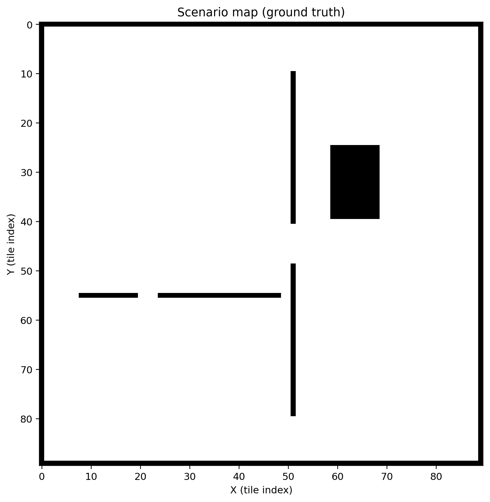

Ground truth occupancy grid for the unified scenario. Black cells are obstacles (outer boundary walls plus internal walls and a rectangular block); white cells are free space. Axes show tile indices.

**Figure 2: Overlay Cells**

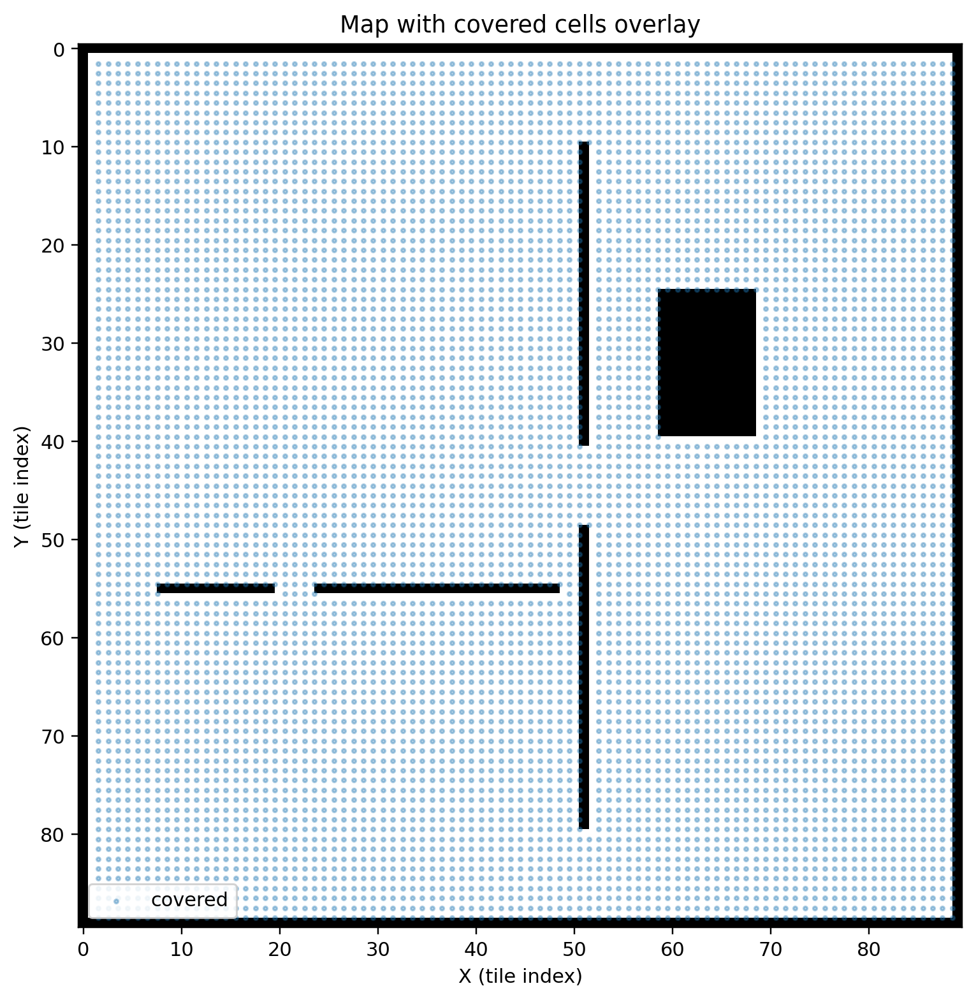

Same map as Figure 1, with the set of cells marked covered during the BA* run overlaid as blue markers. This visualizes which free cells were covered relative to the obstacle layout.

**Figure 3: Robot Trajectory**

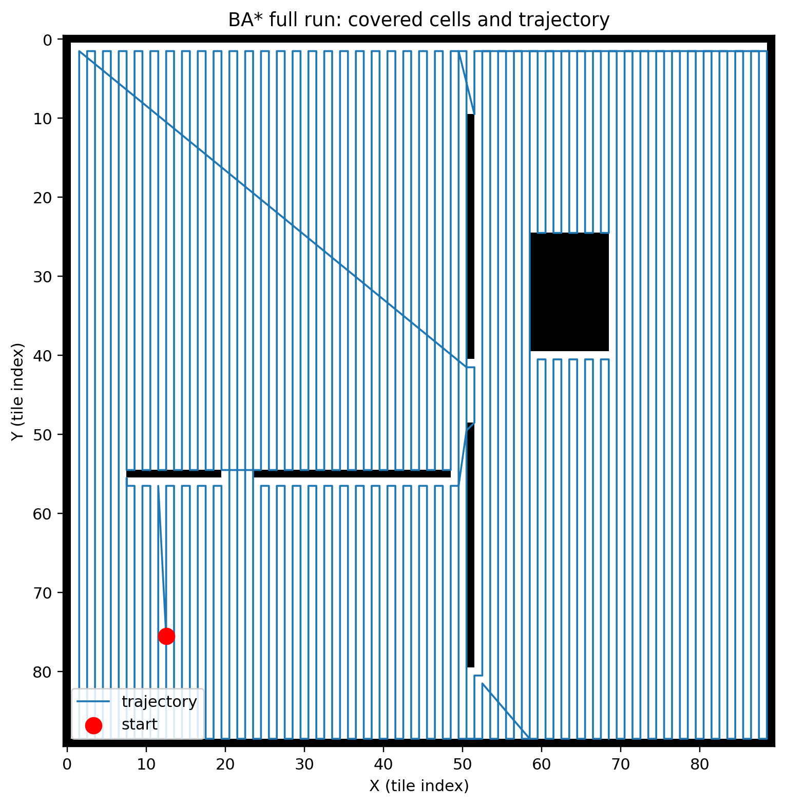

Trajectory of the robot over the unified scenario, drawn as a polyline over the map. The red dot marks the start location (consistent with the unified run start), and the dense vertical sweep pattern illustrates boustrophedon style coverage.

**Figure 4: Candidate Selection**

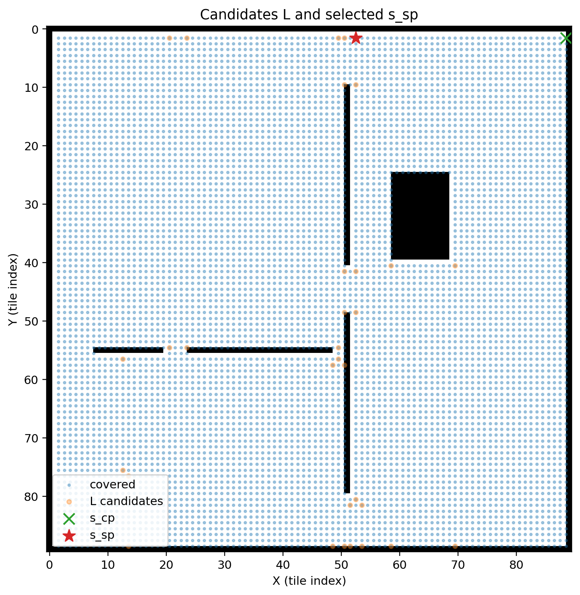

Visualization of the candidate backtracking list $L$ and the chosen starting point $s_{sp}$. Blue markers show covered cells; orange markers show cells in $L$; the green “x” marks the critical point $s_{cp}$, and the red star marks the selected starting point $s_{sp}$ used for the first backtracking event.

**Figure 5: Path Smoothing**

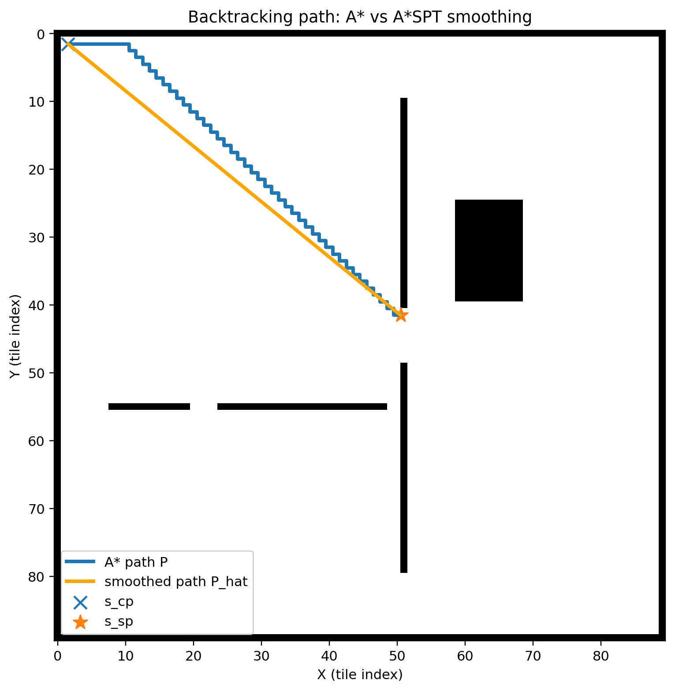

Comparison of the raw A* backtracking path $P$ and the smoothed waypoint path $\hat{P}$ for the first backtracking event. The plot marks $s_{cp}$ (blue “x”) and $s_{sp}$ (orange star), showing how smoothing reduces the original grid path to a shorter waypoint sequence.


# Conclusion

This report describes BA*, an online complete coverage algorithm that performs boustrophedon sweeping most of the time and uses A* on a tiling model for intelligent backtracking when sweeping reaches a critical point. The implementation and evaluation sections are structured to report coverage rate, traveled path length, and the number of boustrophedon regions in simulation.

# References

[1] Hoang Huu Viet, Viet Hung Dang, Md Nasir Uddin Laskar, TaeChoong Chung. *BA*: an online complete coverage algorithm for cleaning robots. *Applied Intelligence*, 39:217 to 235, 2013. DOI: 10.1007/s10489-012-0406-4. 

[2] H. Choset, P. Pignon. Coverage path planning: The boustrophedon cellular decomposition. In *Proceedings of the International Conference on Field and Service Robotics (FSR)*, Canberra, Australia, 1997. 

